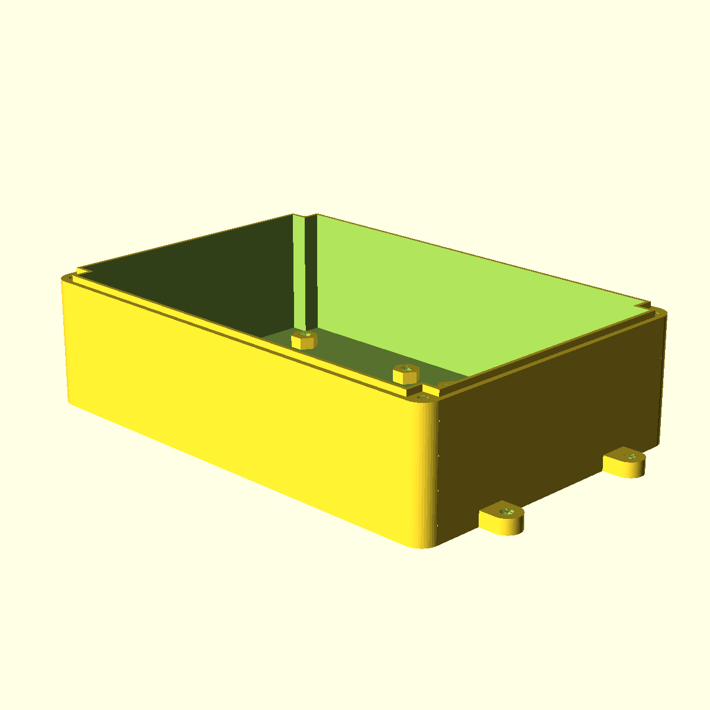
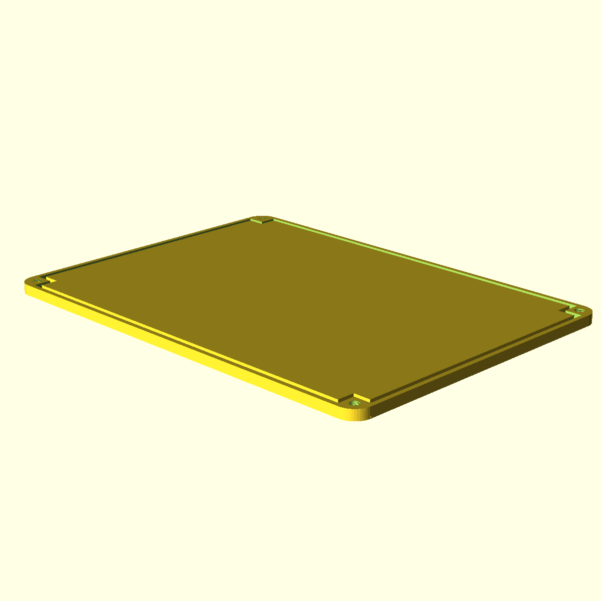

===============
Complete Models
===============

RoboPhery Control Boxes
=======================

Compute Box
-----------

Power Box
---------

Sensor Box
----------

Device Models
=============

Raspberry Pi
------------

Beagle Bone
------------

Gardening Models
================

Water Management
----------------

Support Frame
-------------

Miscellaneous Projects
======================

