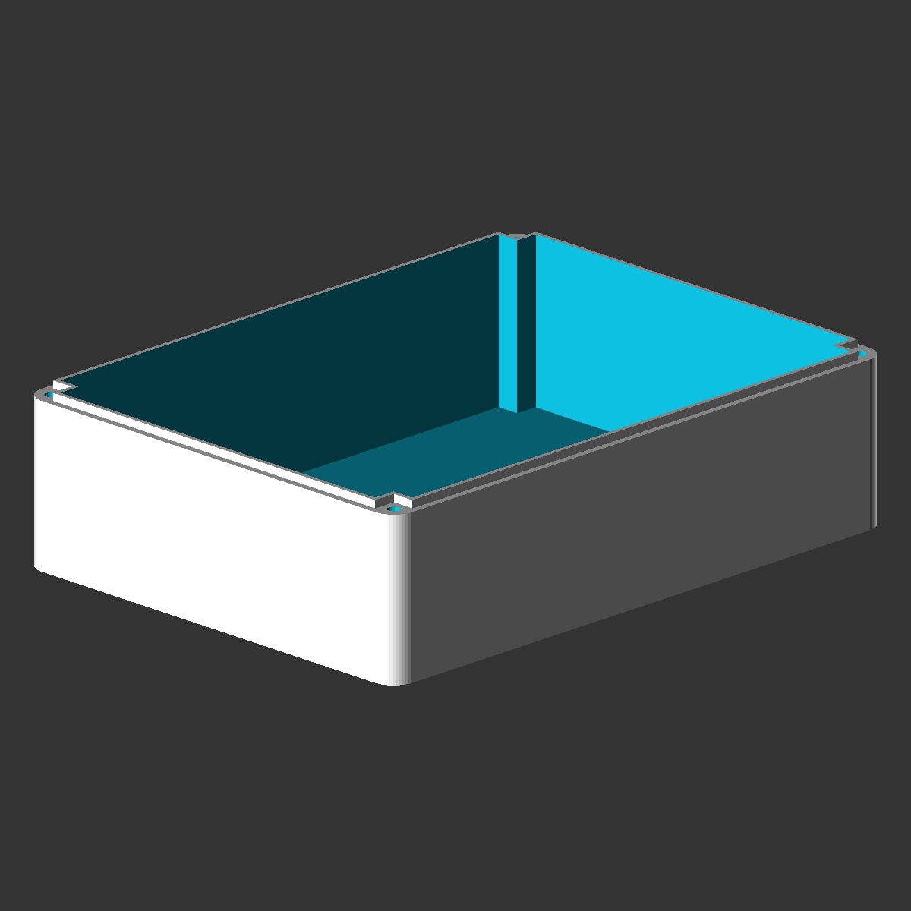
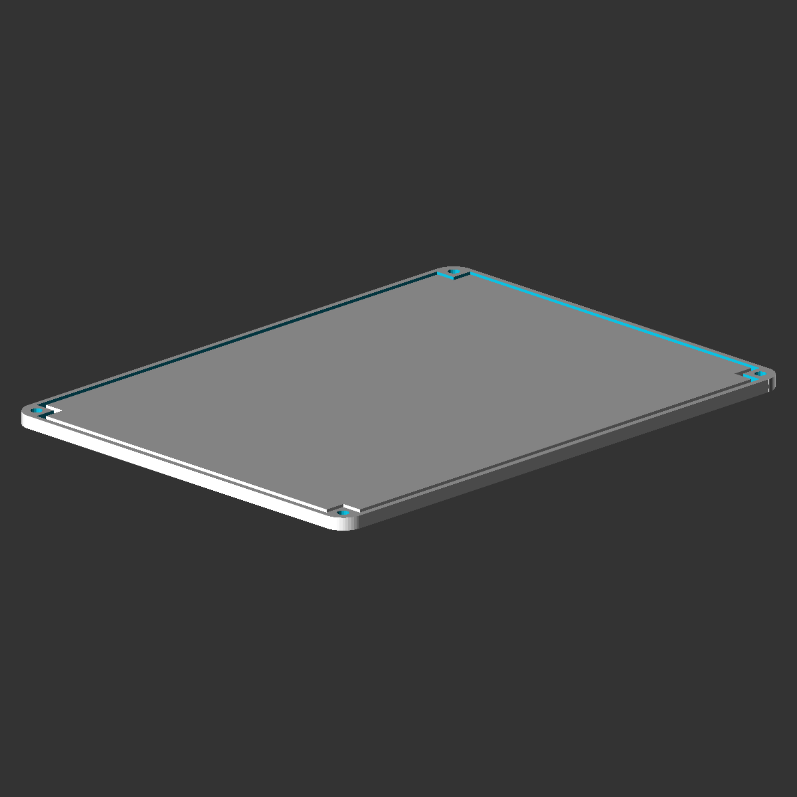
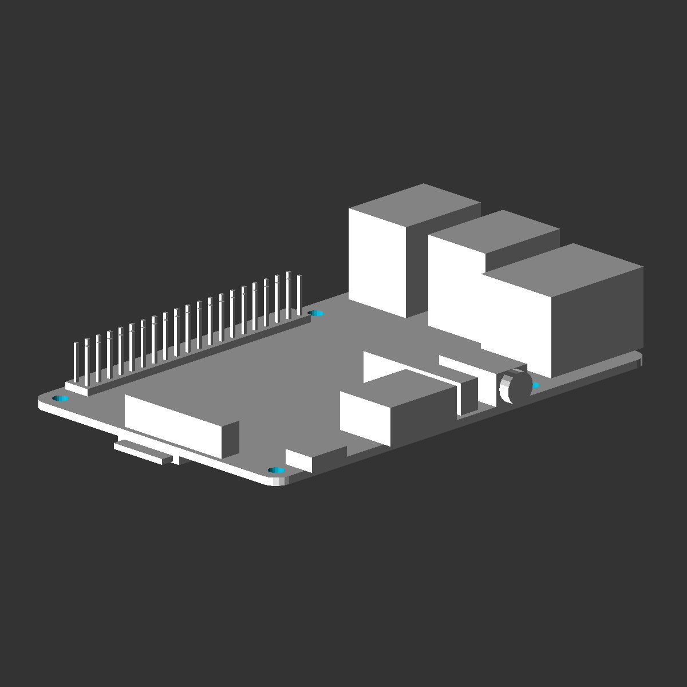
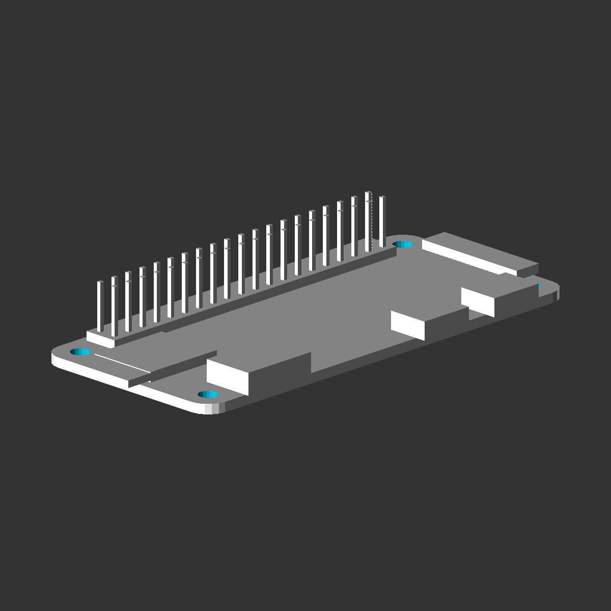
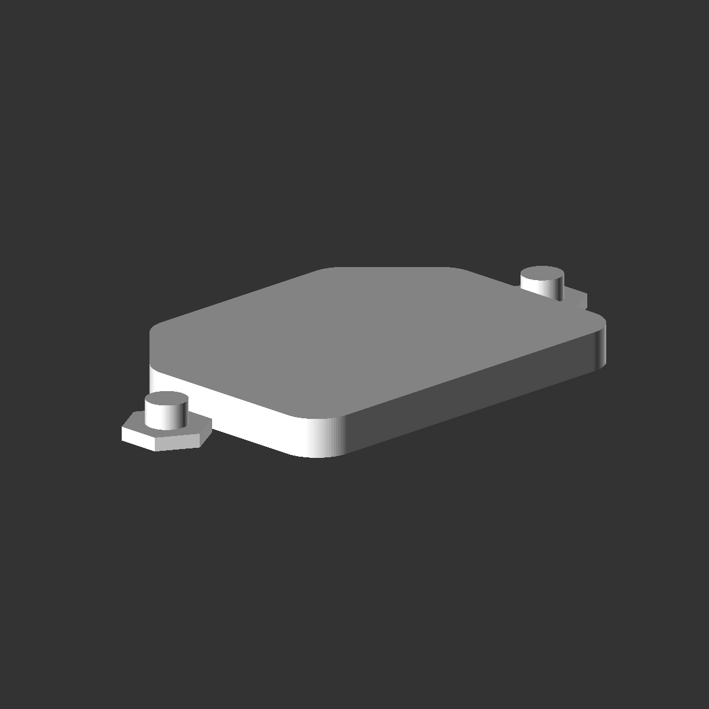
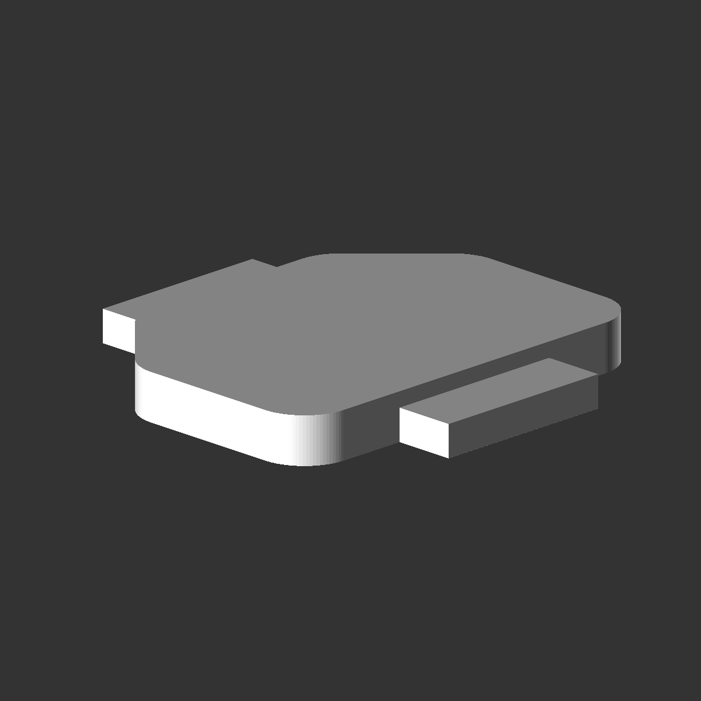
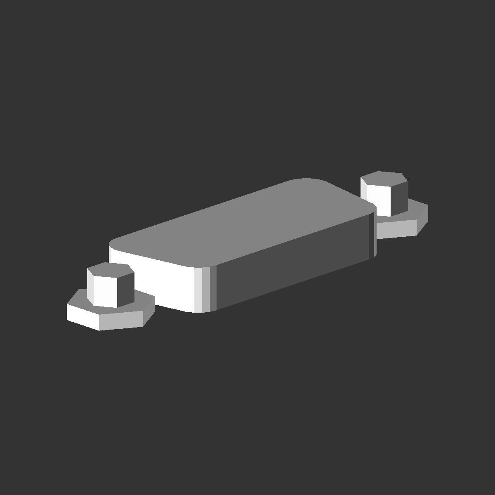
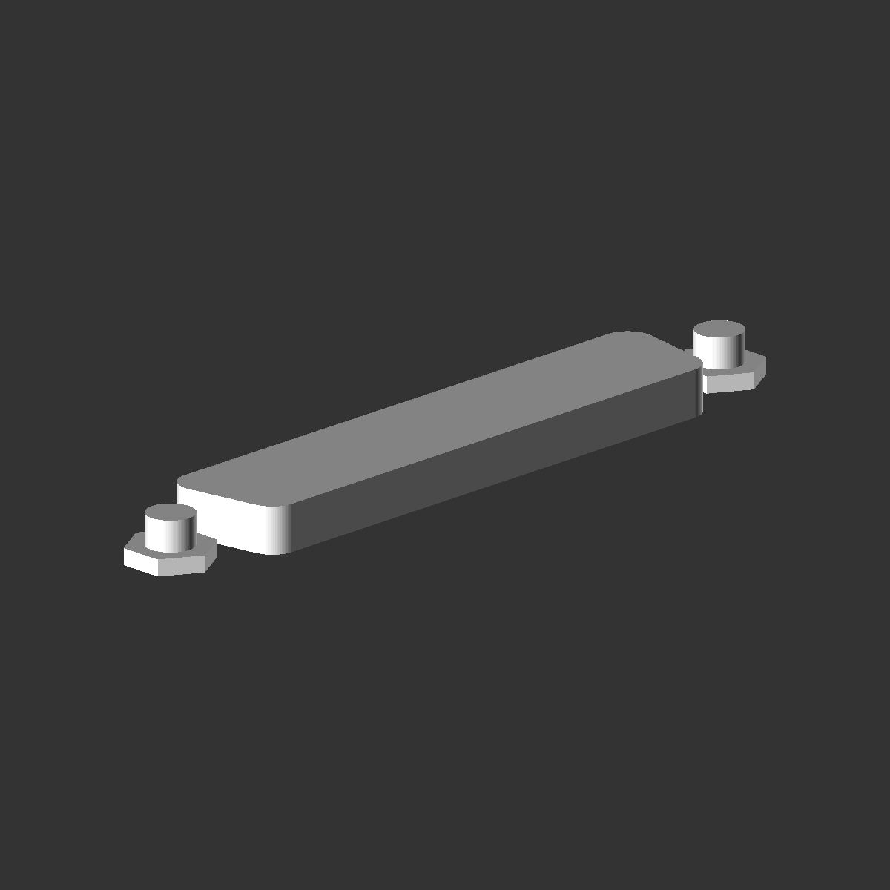
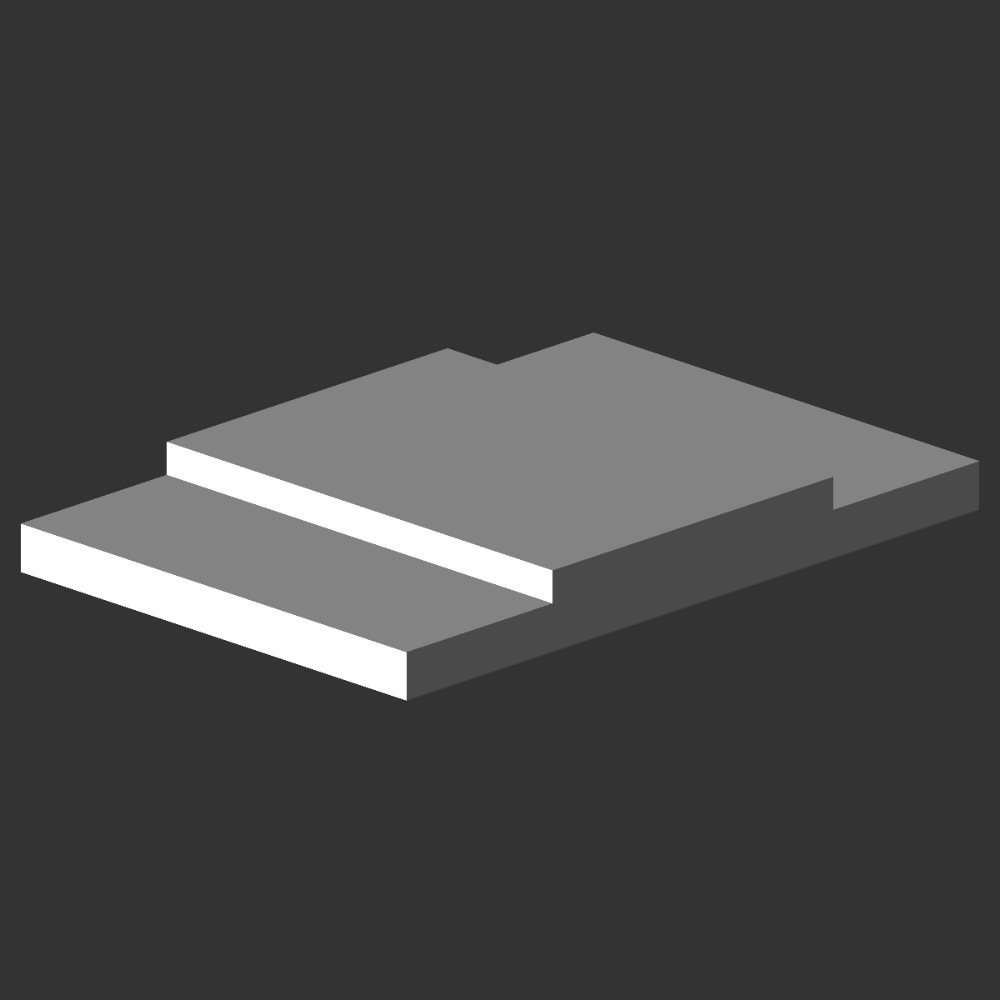
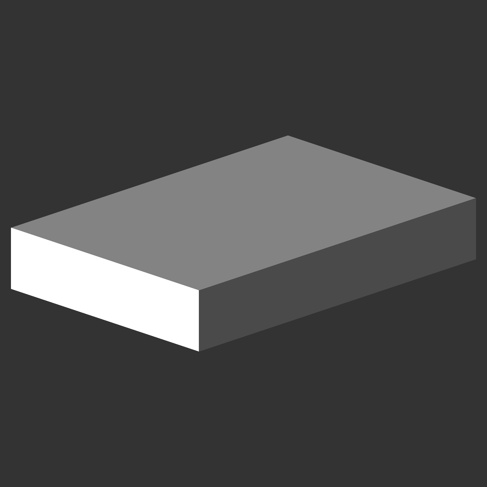

==================
Generic components
==================

Container models
================

Waterproof box
--------------

Device models
=============

Raspberry Pi
------------

Connector extrusions
====================

EURO connectors
---------------

D-SUB connectors
----------------

Keystone connectors
-------------------

Button extrusions
=================

Button P-H8550VB01
------------------

