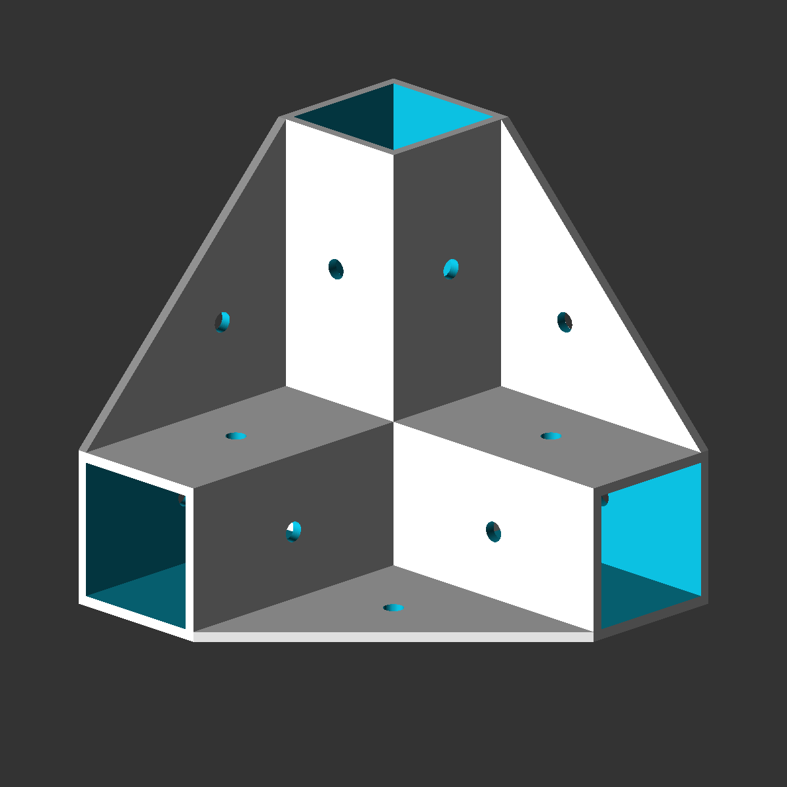
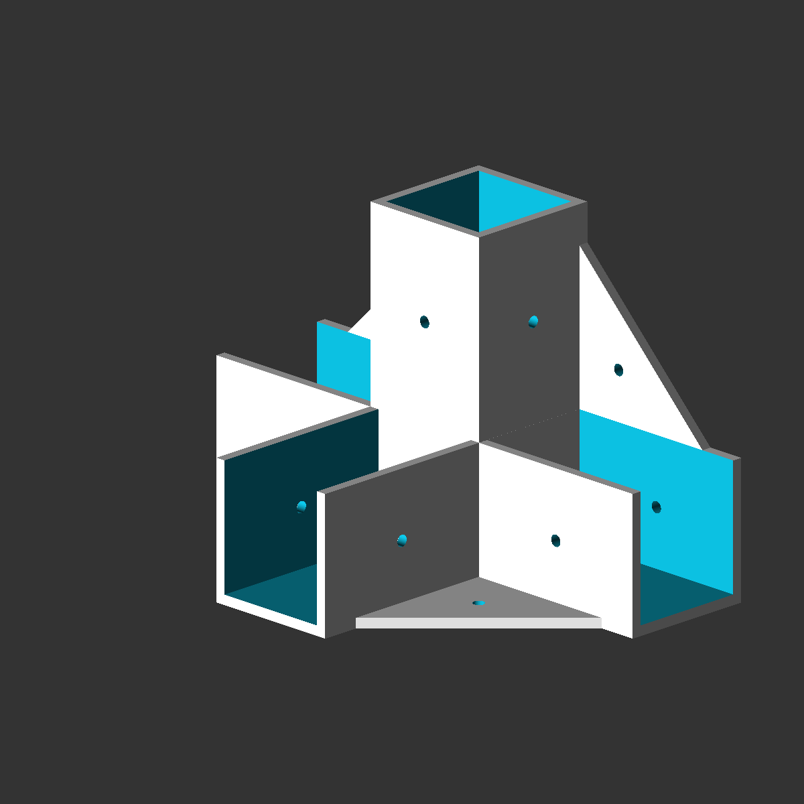
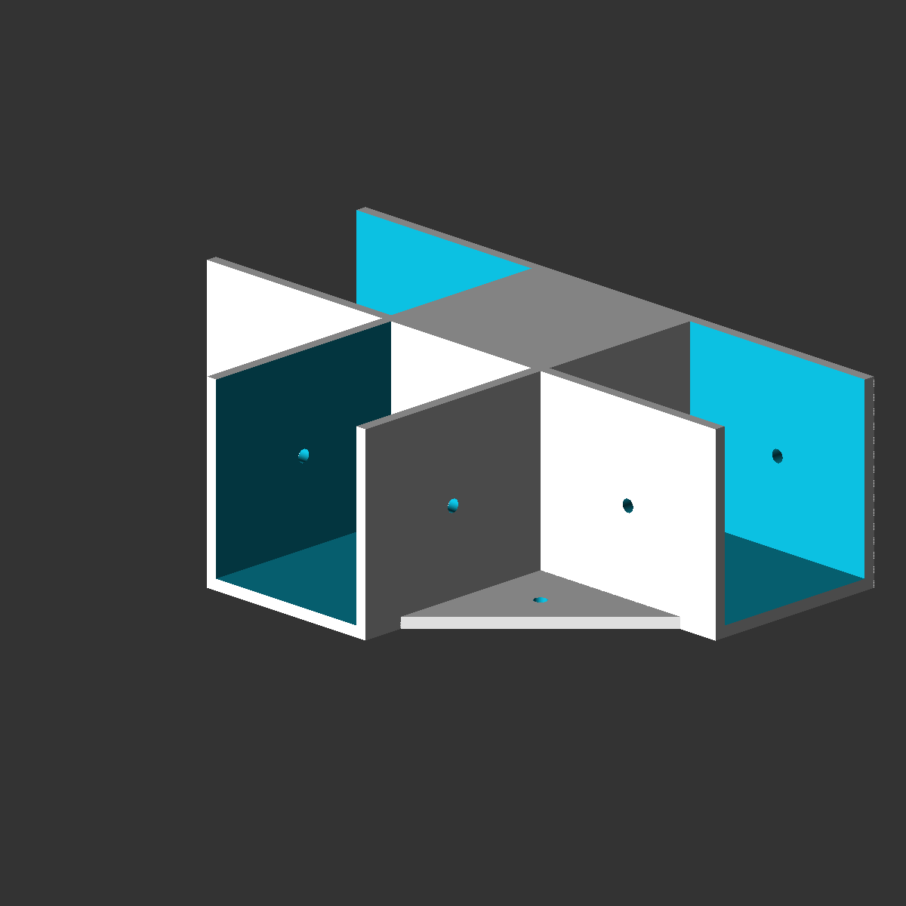
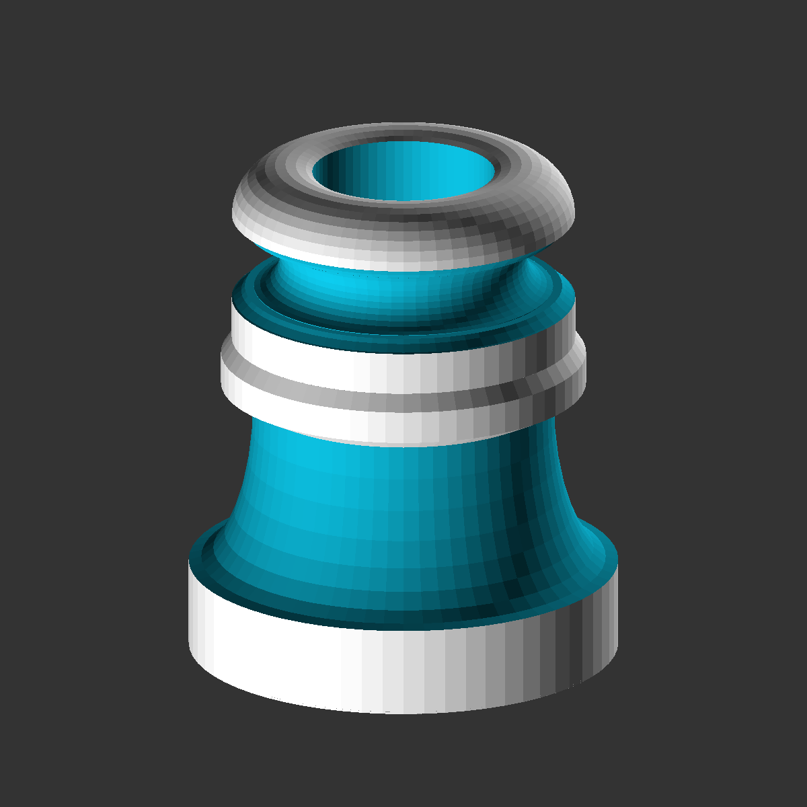
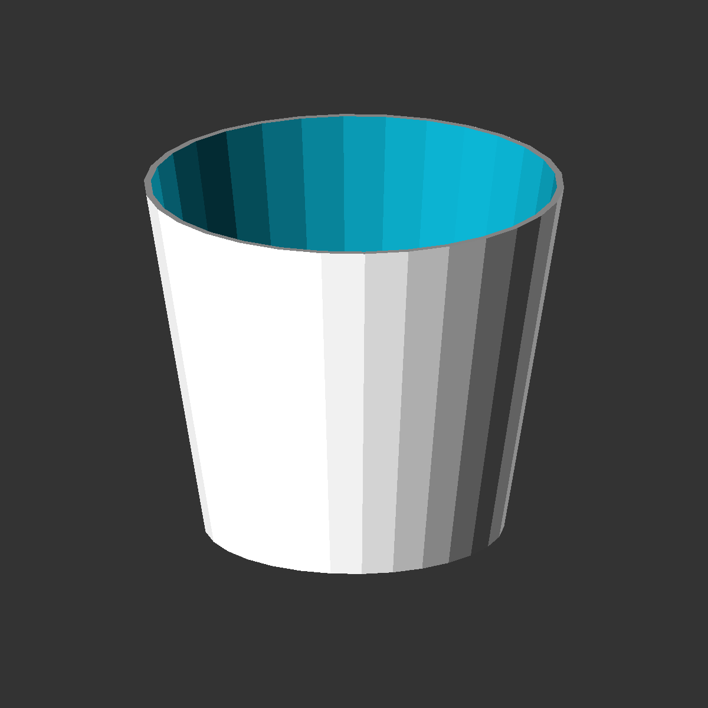
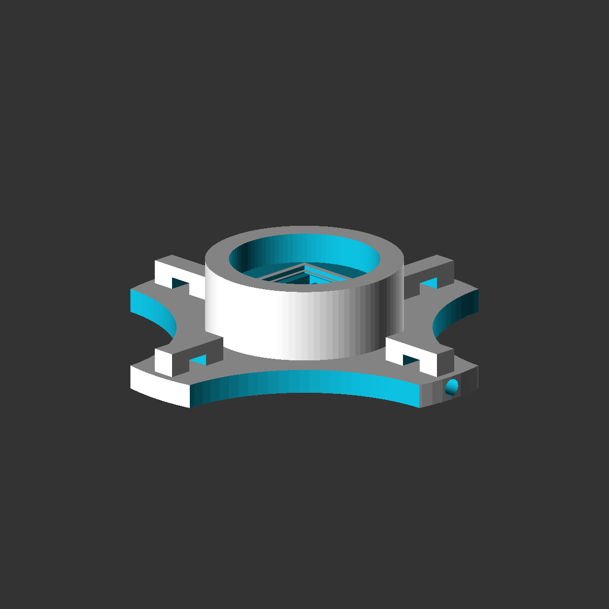
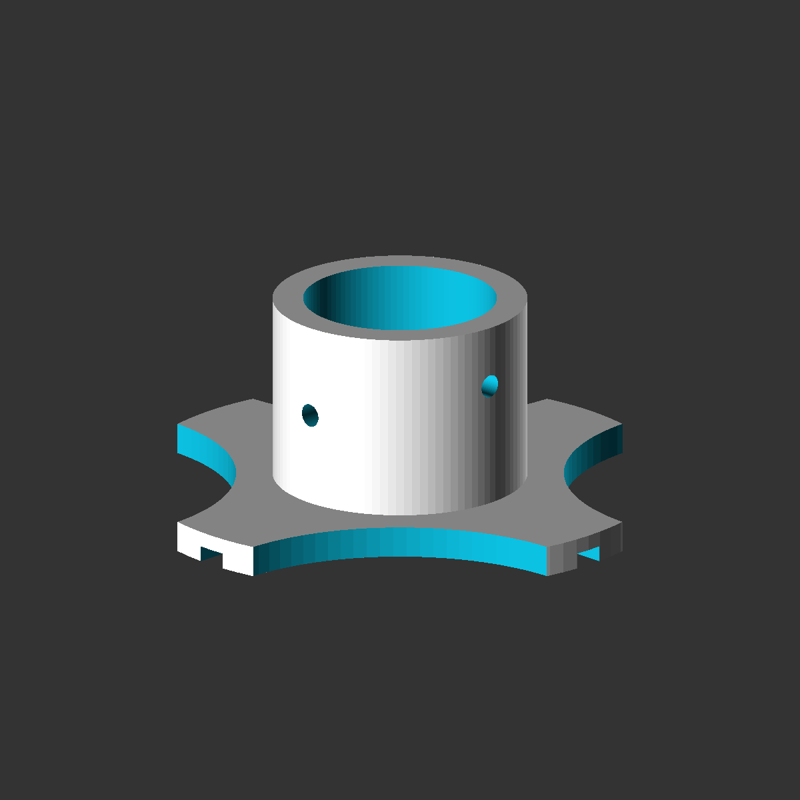

===================
Reusable Components
===================

Container Models
================

Waterproof Box
--------------

.. image:: img/waterproof_box_case.png
   :width: 45 %
   :alt: Waterproof box case

.. image:: img/waterproof_box_lid.png
   :width: 45 %
   :alt: Waterproof box lid

Device Models
=============

Raspberry Pi
------------

.. image:: img/raspberrypi3.png
   :width: 45 %
   :alt: Raspberry Pi 3

.. image:: img/raspberrypi_zero.png
   :width: 45 %
   :alt: Raspberry Pi Zero

Box Corner Models
=================

Rectangular Shape
-----------------

Connector Extrusions
====================

EURO Connectors
---------------

.. image:: img/euro_GSD4.png
   :width: 45 %
   :alt: EURO connector GSD4

.. image:: img/euro_Schurter_6100_4.png
   :width: 45 %
   :alt: EURO connector Schurter 6100-4

D-SUB Connectors
----------------

.. image:: img/dsub_9R.png
   :width: 45 %
   :alt: D-SUB 9R

.. image:: img/dsub_25R.png
   :width: 45 %
   :alt: D-SUB 25R

Keystone connectors
-------------------

.. image:: img/keystone_cat5e.png
   :width: 45 %
   :alt: Keystone CAT 5e

Button Extrusions
=================

Button P-H8550VB01
------------------

.. image:: img/button_P_H8550VB01.png
   :width: 45 %

Water Connectors
================

Water Hose Connectors
---------------------

Flower Pots
-----------

Water-level Meter
-----------------

