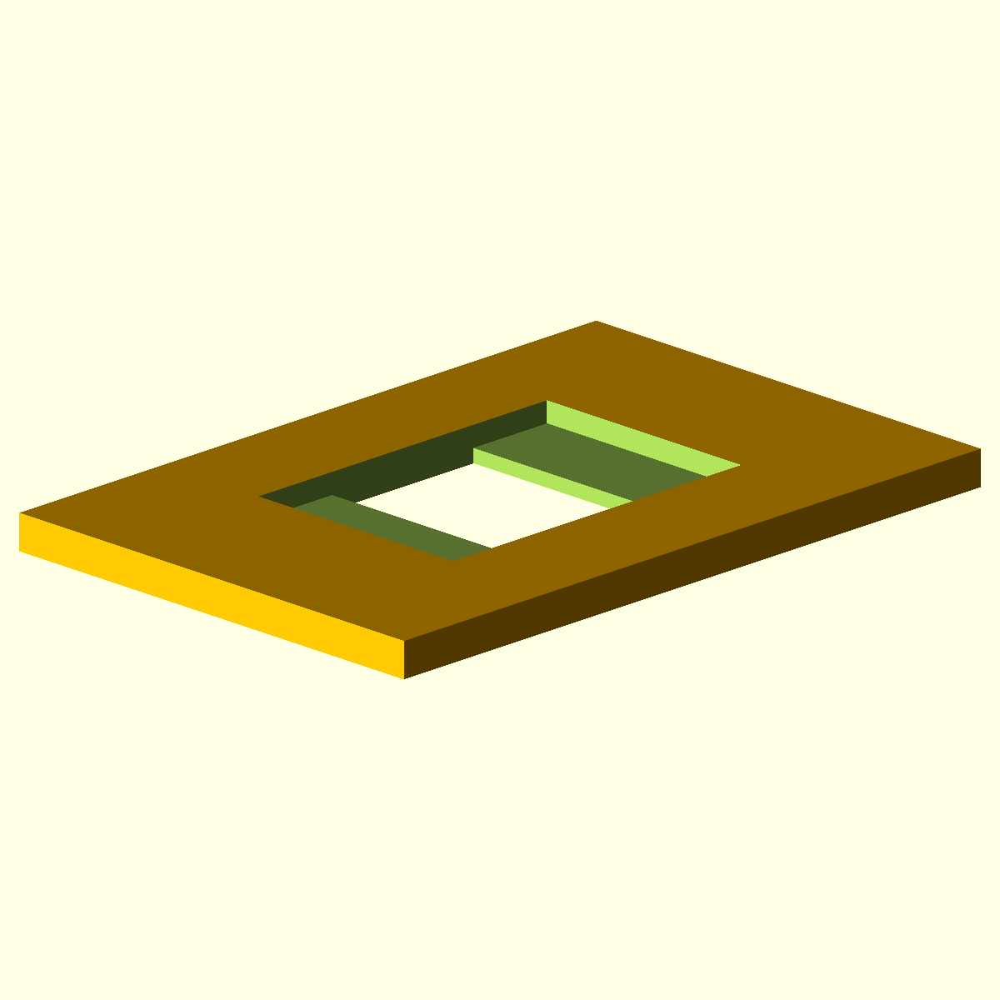

===================
Reusable Components
===================

Container Models
================

Waterproof Box
--------------

Bolts and Nuts
==============

.. image:: img/primitive/bolt_cone_head.png
   :width: 45 %

Electronic Components
=====================

.. image:: img/primitive/connector_jack.png
   :width: 45 %

.. image:: img/primitive/connector_pitch254_male.png
   :width: 45 %

Connector Extrusions
====================

EURO Connectors
---------------

D-SUB Connectors
----------------

Keystone connectors
-------------------

Power connectors
----------------

Simple Extrusions
-----------------

Physical connections
====================

Water Components
================

Water Hose Connectors
---------------------

Bottle Caps
-----------

Flower Pots
-----------

